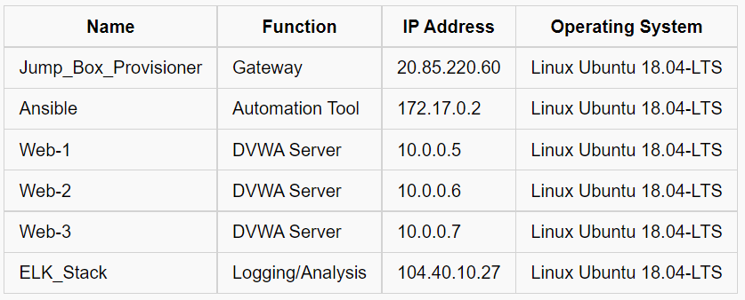
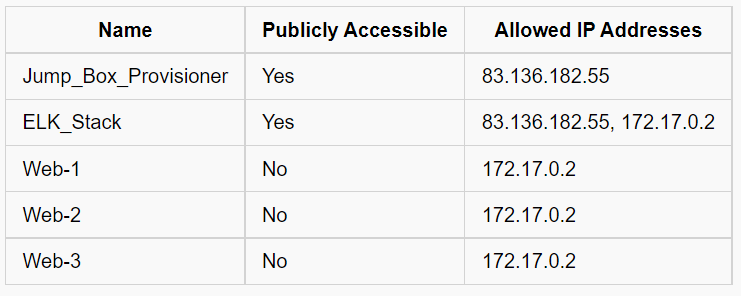
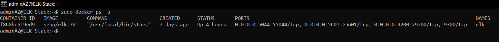
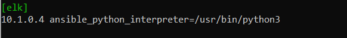

## My Virtual Cloud Network
This repository was created as a means for me to backup data and also to showcase some of the projects I completed while attending University of Denvers Cybersecurity Bootcamp.
In this repository you'll have access to my: 
- [Linux scripts](https://github.com/JoPLe788/CyberSecClass/tree/main/Linux)
  - My Linux scripts were created to help me understand the importance of automating repetative tasks.

- [Ansible scripts](https://github.com/JoPLe788/CyberSecClass/tree/main/Ansible)
  - My Ansible scripts were used to create and configure multiple docker containers in my cloud network.

- [Network diagrams](https://github.com/JoPLe788/CyberSecClass/tree/main/Diagrams)
  - My Network diagrams were created to map out my virtual cloud network.

- [Image files](https://github.com/JoPLe788/CyberSecClass/tree/main/Images)
  - My Image files are used as a visual aid for certain tasks in my **Automated ELK Stack Deployment** description.

The final deployment of my cloud network is as follows: 
- One Jump Box server (which hosts an Ansible container) 
- Four web servers (three running DVWA containers and one running an ELK Stack container)
- One load balancer (configured to allow public access to my DVWA host machines)
- Two firewalls (used to restrict access into my networks).


## Automated ELK Stack Deployment

The files in this repository were used to configure the network depicted below.


These files have been tested and used to generate a live ELK deployment on Azure. They can be used to either recreate the entire deployment pictured above. Alternatively, select portions of the Ansible file may be used to install only certain pieces of it, such as Filebeat.

- [Ansible scripts](https://github.com/JoPLe788/JL_DUBootCamp/blob/main/Ansible/)

This document contains the following details:
- Description of the Topology
- Access Policies
- ELK Configuration
  - Beats in Use
  - Machines Being Monitored
- How to Use the Ansible Build


### Description of the Topology

The main purpose of this network is to expose a load-balanced and monitored instance of DVWA, the D*mn Vulnerable Web Application.
Load balancing ensures that the application will be highly available, in addition to restricting access to the network.

Load balancers help protect the **“Availability”** concept of the **CIA triad _(Confidentiality, Integrity, and Availability)_**. 
- The function of a load balancer is to: 
  - Monitor incoming network traffic volume
  - Route traffic to it's destination by selecting the most effient path
    - *e.g., If one of the web servers goes down, the load balancer reroutes traffic to other available servers.* 
  - Reduce or nullify any downtime a webserver might incur

Deploying a properly configured **"Jump Box"** will;
- *limit access into your virtual network(s)*
- *make configuring associated servers easier*
- *increase network security by utilizing multi-factor authentication*

Integrating an ELK server allows users to easily monitor the vulnerable VMs for changes to the data and system logs.

- **_Filebeat_** collects log/event data from associated systems, which are then used to monitor network traffic activities.
- **_Metricbeat_** collects metric data from associated systems and then transfers the data to “**_Logstash_**” or “**_Elasticsearch_**” for viewing.

The configuration details of each machine may be found below.



### Access Policies

The machines on the internal network are not exposed to the public Internet. 

Only the Jump_Box_Provisioner and ELK_Stack machine can accept connections from the Internet. Access to these machines is only allowed from the following IP address:
- 83.136.182.55

Machines within the network can only be accessed by SSH (Secure Shell).

- The only machine in the network that has access privileges to the **“ELK_Stack”** *(IP:104.40.10.27)* is the **“Ansible”** container *(IP:172.17.0.2)*.

A summary of the access policies in place can be found in the table below.



### Elk Configuration

Ansible was used to automate configuration of the ELK machine. No configuration was performed manually, which is advantageous because...

- The advantage of using Ansible to automate system configurations is that it greatly reduces the time it would take to manually configure each system, there by freeing up the user to focus their time on more important tasks.

The playbook implements the following tasks:

- Install and configure Docker service
- Configures virtual memory for VM
- Download and launch a Docker ELK container
- Enable Docker service on bootup

The following screenshot displays the result of running `docker ps` after successfully configuring the ELK instance.



### Target Machines & Beats
This ELK server is configured to monitor the following machines:

- **10.0.0.5 (Web-1)**
- **10.0.0.6 (Web-2)**
- **10.0.0.7 (Web-3)**

We have installed the following Beats on these machines:

- **filebeat**
- **metricbeat**

These Beats allow us to collect the following information from each machine:

- “**_Filebeat_**” collects: 
  - audit logs
  - deprecation logs
  - gc logs
  - server logs
  - slow logs

- “**_Metricbeat_**” collects: 
  - metric data from **http://localhost:9200** (this is the default path, but can be changed to fit the user's needs)

### Using the Playbook
**In order to use the playbook, you will need to have an Ansible control node already configured. Assuming you have such a control node provisioned, follow the steps below:** 

1. SSH into the control node.
2. Copy the _ELK_install.yml_ file to _/etc/ansible/roles/ directory_.
3. Update the _hosts_ file to include the `[elk]` server, add your _private IP address_ with the following: `ansible_python_interpreter=/usr/bin/python3`

**See _Image_ for example of step 3:** 



**Run the playbook with the command:** 
``` 

ansible-playbook /etc/ansible/roles/ELK_install.yml 

```
**Check that the installation worked as expected, navigate to:** 
```

http://(your_elk_server_ip_address):5601/app/kibana

```
**The playbook can be downloaded to the correct directory running this command:** 
```

curl https://github.com/JoPLe788/CyberSecClass/blob/main/Ansible/ELK_install.yml > /etc/ansible/roles/ELK_install.yml

```

